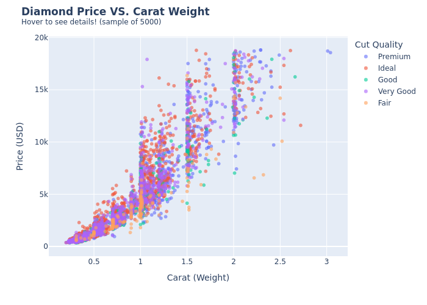
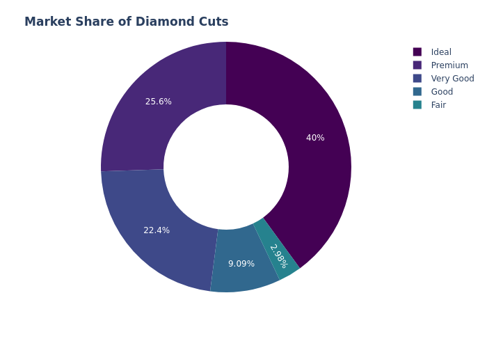
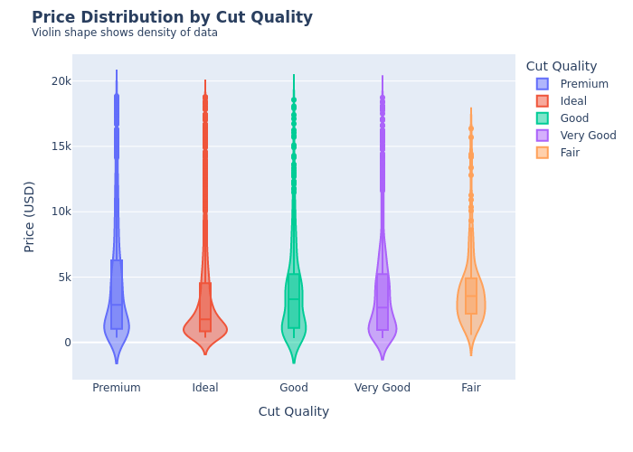
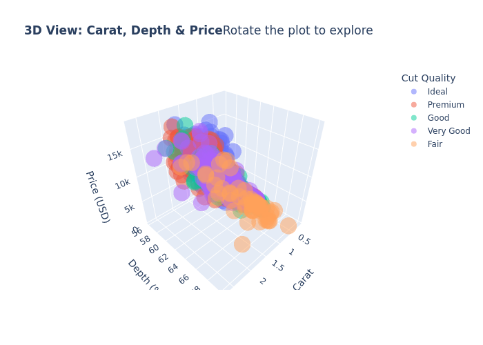

# 📊 CodeAlpha_DataVisualization

Interactive Data Visualization on the Diamonds dataset for the CodeAlpha Data Analytics Internship. This Python project transforms raw data into compelling visual stories using Plotly Express, featuring interactive HTML dashboards, 3D plots, and static exports.


🌟 **Intern:** Prinkle Kella | **CodeAlpha Data Analytics Internship** | **June 2026**

---

## 🎯 Project Objective

The objective of this task was to transform raw data into visual formats like charts and interactive dashboards. While EDA (Task 2) focuses on statistical discovery, Data Visualization focuses on storytelling and presentation—designing compelling, interactive visuals that reveal insights clearly to clients and stakeholders.

---

## 🛠️ Tools & Technologies

* Python 3.12
* Plotly Express: For creating interactive, publication-quality graphs (Scatter, Donut, Violin, 3D)
* Pandas: For data manipulation and preprocessing
* Kaleido: For exporting interactive Plotly charts as static PNG images for documentation

---

## 📊 Dataset Source

* Dataset: Seaborn Built-in Diamonds Dataset
* Description: Contains prices and attributes of almost 54,000 diamonds.
* Features: Carat, Cut, Color, Clarity, Depth, Table, Price, and Dimensions (x, y, z).

---

## ⚙️ Methodology & Implementation

### 1. Data Loading & Cleaning

Loaded the dataset and removed 20 rows with logically incorrect 0-dimension values (x, y, z = 0) to ensure clean visualizations.

### 2. Interactive Scatter Plot (Carat vs Price)

Created an interactive scatter plot using Plotly with hover_data enabled. Users can hover over data points to see exact Price, Carat, Cut, Color, and Clarity details. Clicking the legend isolates specific cut categories.

### 3. Donut Chart (Market Share of Diamond Cuts)

Designed a sleek Donut Chart (using hole=0.5 in Plotly) to clearly display the proportional market share of each diamond cut quality.

### 4. Violin Plot (Price Distribution by Cut)

Built an advanced Violin Plot with box=True and points='outliers'. This combines the distribution density of a violin plot with the statistical summary of a boxplot, highlighting outliers dynamically.

### 5. 3D Scatter Plot (Carat, Depth, Price)

Generated an interactive 3D scatter plot allowing users to click and drag to rotate the visualization in 3D space, revealing the multidimensional relationship between weight, depth percentage, and price.

### 6. Dual Export Strategy

Every chart is exported twice:

* Interactive HTML (.html): Fully interactive dashboards viewable in any web browser.
* Static PNG (.png): High-quality images for GitHub README and portfolio screenshots.

---

## 📸 Output Previews & Interactive Files

### 1. Price vs Carat Weight (Interactive Scatter Plot)



**Interactive File:** `interactive_plots/scatter_carat_price.html`

**Insight:** Shows the exponential price curve. Hover to see specific diamond attributes.

---

### 2. Market Share of Diamond Cuts (Donut Chart)



**Interactive File:** `interactive_plots/donut_cut_share.html`

**Insight:** Visually breaks down the proportion of cut qualities, with Ideal dominating the market.

---

### 3. Price Distribution by Cut Quality (Violin Plot)



**Interactive File:** `interactive_plots/violin_price_cut.html`

**Insight:** Reveals data density and outliers simultaneously. The wider the violin, the more diamonds exist at that price point.

---

### 4. 3D View: Carat, Depth & Price (3D Scatter Plot)



**Interactive File:** `interactive_plots/3d_scatter.html`

**Insight:** Allows rotational exploration of how depth percentage interacts with carat and price.

---

## 💡 Key Learnings & Challenges

* Interactive vs. Static Visuals: Learned when to use static charts (Seaborn) for quick statistical analysis vs. interactive charts (Plotly) for client-facing presentations.
* Plotly Hover Data: Discovered how adding extra hover_data parameters significantly enhances the user experience without cluttering the visual.
* 3D Visualization: Gained experience rendering 3D plots, understanding the need for smaller data samples (df.sample) to maintain browser performance.
* Kaleido Integration: Solved the challenge of exporting Plotly's web-based interactive charts into static PNG images for offline documentation using the Kaleido library.

---

## 🚀 How to Run Locally

### Clone the Repository

```bash
git clone https://github.com/PrinkleMahshwari/CodeAlpha_DataVisualization.git
```

### Navigate to the Project Directory

```bash
cd CodeAlpha_DataVisualization
```

### Install Required Libraries

```bash
pip install -r requirements.txt
```

### Run the Visualization Script

```bash
python src/visuals.py
```

**Note:** After running, check the `interactive_plots/` folder and open any `.html` file in your web browser to experience the interactive charts!

---

## 📂 Project Structure

```text
CodeAlpha_DataVisualization/
├── data/                       # Dataset files
│   └── diamonds.csv            # Exported dataset
├── interactive_plots/          # Interactive HTML visualizations
│   ├── 3d_scatter.html
│   ├── donut_cut_share.html
│   ├── scatter_carat_price.html
│   └── violin_price_cut.html
├── screenshots/                # Static PNG images for README
│   ├── 3d_scatter.png
│   ├── donut_cut_share.png
│   ├── scatter_carat_price.png
│   └── violin_price_cut.png
├── src/                        # Source code directory
│   └── visuals.py              # Main visualization script
├── README.md                   # Project documentation
└── requirements.txt            # Python dependencies
```

---

## 🙏 Acknowledgements

This project was completed as part of the **CodeAlpha Data Analytics Internship Program**.

- **Dataset Source:** Seaborn Built-in Datasets
- **Internship Organization:** [CodeAlpha](https://www.codealpha.tech/)
- **Repository:** [CodeAlpha_DataVisualization](https://github.com/PrinkleMahshwari/CodeAlpha_DataVisualization)

Special thanks to **CodeAlpha** for providing this internship opportunity and to the open-source Python community for the tools used in this project.

---

## 🔗 Important Links

| Resource | Link |
|-----------|------|
| Internship Organization | [CodeAlpha](https://www.codealpha.tech/) |
| GitHub Repository | [CodeAlpha_DataVisualization](https://github.com/PrinkleMahshwari/CodeAlpha_DataVisualization) |
| GitHub Profile | [PrinkleMahshwari](https://github.com/PrinkleMahshwari) |

---

## 📈 Skills Gained

Through this project, I gained practical experience in:

* Interactive Data Visualization
* Plotly Express
* 3D Plotting & Animation
* Donut Charts & Violin Plots
* Exporting Interactive HTML Dashboards
* Static Image Export (Kaleido)
* Data Storytelling
* Python for Data Analytics
* Git & GitHub Documentation

---

## 🚀 Future Improvements

Possible future improvements for this project include:

* Deploying the interactive HTML dashboards online using GitHub Pages or Streamlit
* Creating an animated bubble chart showing how diamond prices change over different carat ranges
* Building a full multi-page interactive dashboard with dropdown filters
* Adding custom themes and branded color palettes using Plotly templates

---

## 🎥 LinkedIn Project Demonstration

As part of the CodeAlpha Internship requirements, a project explanation video has been published on LinkedIn.

**Status:** Done ✅

**LinkedIn Post Link:** [View LinkedIn Project Demonstration](https://www.linkedin.com/posts/prinkle-maheshwari-544417292_dataanalytics-datavisualization-plotly-ugcPost-7471261919522254850-ofOb/)

---

## ⭐ Internship Progress

| Task                      | Status      |
| ------------------------- | ----------- |
| Web Scraping              | ✅ Completed |
| Exploratory Data Analysis | ✅ Completed |
| Data Visualization        | ✅ Completed |
| Sentiment Analysis        | ⏳ Pending   |

---

## 📜 License

This project was developed for educational purposes and as part of the CodeAlpha Data Analytics Internship Program.

---

## ✅ Project Status

**Status:** Completed

**Internship Task:** Data Visualization

**Primary Outcome:** Successfully transformed raw data into 4 interactive and static visualizations using Plotly Express.

**Submission Ready:** Yes

**Documentation Ready:** Yes

**GitHub Ready:** Yes

**LinkedIn Publication:** Pending

---

## 👨‍💻 Author

**Prinkle Kella**

BS Software Engineering Student | Data Analytics Intern

- GitHub: [PrinkleMahshwari](https://github.com/PrinkleMahshwari)
- LinkedIn: [Project Demonstration Video](https://www.linkedin.com/posts/prinkle-maheshwari-544417292_dataanalytics-datavisualization-plotly-ugcPost-7471261919522254850-ofOb/)
- Project: **CodeAlpha_DataVisualization**
- Internship: **CodeAlpha Data Analytics Internship**

Thank you for visiting this repository. Feedback, suggestions, and improvements are always welcome.

---

## 🔍 SEO Keywords

Data Visualization Project, Python Data Visualization, Plotly Express, Interactive Dashboard, Interactive Charts, Data Storytelling, Python Plotly Project, 3D Scatter Plot, Donut Chart, Violin Plot, Kaleido Export, HTML Dashboard, Data Analytics Project, Diamonds Dataset Visualization, Plotly Dashboard, Business Intelligence, Data Science Portfolio, Python Data Analytics, Interactive Data Exploration, Statistical Visualization, CodeAlpha Internship, Python Project, Data Visualization Internship, Dashboard Development, Data Presentation, Interactive Graphs, Data Insights, Plotly Charts, Python Portfolio Project.
